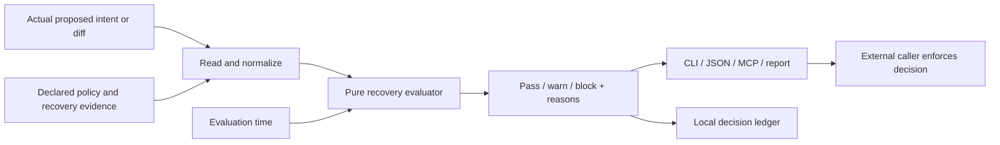
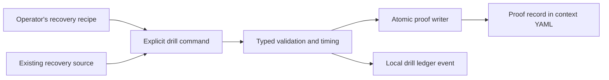

# Restore Gap architecture

Restore Gap evaluates a proposed change against declared recovery requirements
and records the decision. It is one offline Go binary, with a small pure decision
core and explicit adapters for reading inputs, producing evidence and rendering
results. It does not apply the proposed change.

## The decision boundary

`internal/rules` matches typed intents to guards. `internal/contextspec` owns
proof health, binding, expiry and signature semantics; `internal/engine` reduces
findings to a verdict and applies explicit owner exceptions. The evaluator takes
loaded values and an evaluation time. It does not read target systems, invoke
commands, discover cloud dependencies or perform recovery. Path matching uses
the process's resolved home convention; integrations should supply normalized,
absolute paths for reproducible decisions across hosts.

`internal/preflight` owns input loading, verified ledger reads, policy layering,
optional local record appends and report output. CLI and MCP call this same path.
A ledger append is allowed; target-system mutation is not. `--plan` suppresses
the decision append. Recovery does not run implicitly to satisfy a block.

Supported change inputs are intent YAML and unified diffs. Paths, commands,
packages, actors and actions are explicit vocabulary. There is no provider-aware
Terraform-plan, AWS or GitHub-state adapter. An adapter must faithfully describe
the actual operation; omitted resources cannot be evaluated.

## Explicit evidence production

`internal/drill` uses the operator's existing restore tooling. It reconstructs
into a temporary working directory and runs the declared checks. Byte comparison,
SQLite, Git, file-tree, key, command and service checks answer different questions;
a successful shell exit alone is only as useful as the configured check.

`internal/command` bounds execution, propagates cancellation, limits retained
output and cleans up ordinary descendant process groups on Linux and macOS.
The execution timeout is independent of an RTO budget. It does not isolate the
command from the host: a temporary directory is not an OS security sandbox.
An operator-authored recovery command can modify anything its credentials allow.

`internal/proofstore` is the single persistence boundary for drill and ingested
proofs. A stable sidecar lock protects the read/modify/validate/write transaction.
A same-directory temporary file is flushed and atomically renamed. Restrictive
permissions and declarative metadata survive; new evidence replaces old generated
authority. Symlink/nonregular destinations are rejected. This protects cooperating
writers from partial writes and lost updates, not an attacker controlling the
directory or the operator account.

## Proofs and decisions answer different questions

- **Proof health:** What did a record claim, when, and does its signature verify?
- **Guard satisfaction:** Is that evidence sufficiently fresh and strong for this
  particular declared requirement?
- **Change decision:** Do the supplied changes satisfy every applicable guard,
  including declared recovery dependencies affected elsewhere in the same change?
- **Ledger integrity:** Does the recorded history verify against its chain and any
  explicitly recorded owner anchors?

Status and evidence reports reuse intrinsic proof health. A displayed observation
is not automatically a verified recovery. An owner acceptance or override is an
exception, not a passing drill. Legacy evidence remains readable and is identified
when it lacks newer binding guarantees.

## The ledger is the explanation

The local append-only JSONL ledger records decisions, drills, exceptions and
integrity events. New decision records preserve the supplied proposal and the
findings available at evaluation time. Their value is answering: **what did we
check, what evidence did we rely on, and why did this pass or block?**

A decision is not an execution receipt. The gate does not know whether its caller
went ahead, obeyed a block or performed an omitted action. Do not derive incidents
prevented, successful deployments or universal rollback guarantees from counts.

Each entry includes the previous hash and a hash of its canonical content. The
canonical JSON subset sorts keys and permits integer numbers only. Optional fields
preserve the canonical form of older schema-v2 entries. Policy/host stamps aid
provenance; a policy digest does not itself preserve the original policy bytes.

Hash chaining detects inconsistencies relative to retained records. An actor able
to rewrite the entire local ledger can recompute its chain; independent retention
of a signed export or trusted checkpoint is needed to detect that replacement.
An owner-approved chain anchor remains a visible exception, never silent repair.

## Handoff and trust

Full signed bundles are explicit offline archives containing configuration and a
ledger slice. Treat them as sensitive. Minimal summaries use a fixed allowlist and
opaque identifiers so reviewers can verify an evidence claim without receiving raw
paths, commands, URLs or command output. Neither format uploads anything.

A signature checked against a key bundled with the same artifact establishes
self-consistency. Trusted origin requires an expected public key obtained through
an independent channel. Neither establishes that the producing machine, procedure
or declared input was truthful. Keep policy, trusted keys, signing credentials and
the enforcing caller outside an untrusted agent's writable scope.

Evidence can support leadership, compliance or insurance review. It is not a
certification, a guarantee of insurer acceptance, or proof that every possible
change is recoverable. The bundle must retain the scope, method, time and limits
of the actual observation.

## Compatibility and deliberate omissions

- One binary; no required account, daemon, private SDK or hosted service at runtime.
- Existing v2 context YAML and inline proofs remain supported. No database migration.
- Existing JSON fields and exit semantics remain stable; new strict requirements
  are explicit opt-ins for existing integrations.
- Linux and macOS, amd64 and arm64, are the release targets. Tests isolate policy,
  state and fixture paths so they do not depend on the maintainer's machine.
- No backup-storage engine, provider crawler, generic policy language, plugin
  marketplace, remote shell or automatic undo engine.
- An optional operated retention/lapse-monitoring service remains a proposal.
  Local evaluation and offline verification do not depend on it.

## Verification

Tests exercise misleading successes, expiry, altered signatures, changed recipes,
recovery-dependency changes, uncovered resources, broken ledgers, concurrent proof
updates and bounded execution. UI tests use synthetic data; mobile geometry and
visual inspection cover the dashboard and launch page. Native release checks cover
OS-dependent behavior. See [schema](SCHEMA.md), [agent integration](agent-gate.md)
and [drill authoring](drill-authoring.md) for concrete interfaces.
